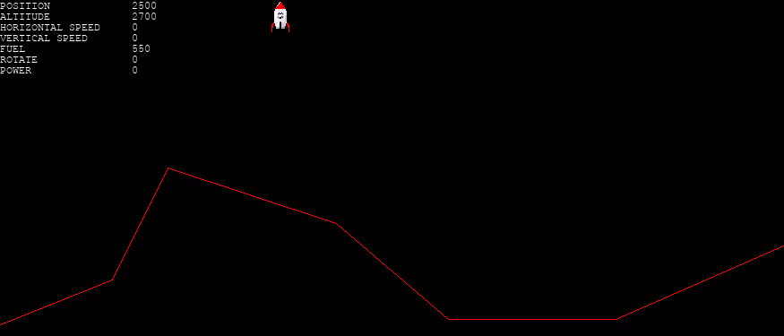
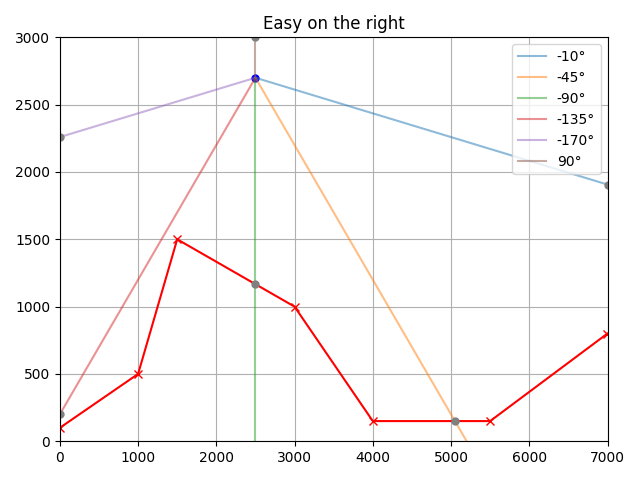
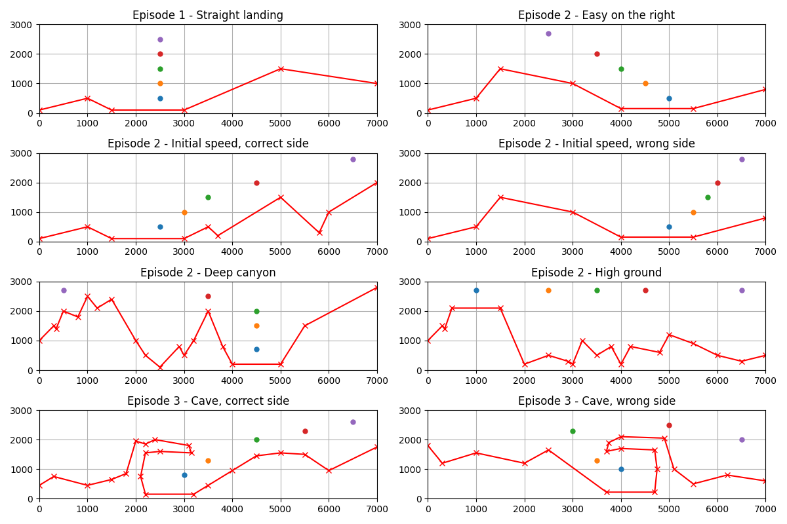

# Gymnasium Mars Lander

[](https://pre-commit.com/)
[](https://github.com/astral-sh/ruff)
[](https://github.com/astral-sh/ty)

Gymnasium environment for the Mars Lander CodinGame puzzles:

- [Mars Lander - Episode 1](https://www.codingame.com/training/easy/mars-lander-episode-1)
- [Mars Lander - Episode 2](https://www.codingame.com/training/easy/mars-lander-episode-2)
- [Mars Lander - Episode 3](https://www.codingame.com/training/easy/mars-lander-episode-3)
- [Mars Lander - Optimization](https://www.codingame.com/multiplayer/optimization/mars-lander)



<table>
    <tbody>
        <tr>
            <td>Action Space</td>
            <td><code>Box(-1, 1, (2,), float32)</code></td>
        </tr>
        <tr>
            <td>Observation Space</td>
            <td><code>Box(-1, 1, (13,), float32)</code></td>
        </tr>
        <tr>
            <td>Import</td>
            <td><code>gymnasium.make("gymnasium_mars_lander:gymnasium_mars_lander/MarsLander-v1")</code></td>
        </tr>
    </tbody>
</table>

This package is inspired by the article of Antoine
Broyelle: [Learning to Land on Mars with Reinforcement Learning](https://antoinebrl.github.io/blog/rl-mars-lander/).

## Installation

To install `gymnasium-mars-lander` with pip, execute:

```bash
pip install gymnasium_mars_lander
```

From source:

```bash
git clone https://github.com/Quentin18/gymnasium-mars-lander
cd gymnasium-mars-lander/
pip install -e .
```

For running on CPU with extras:

```bash
pip install -e .[training,testing,quality] --extra-index-url https://download.pytorch.org/whl/cpu
```

## Environment

### Action Space

The action is a `ndarray` with two continuous variables:

- The rotation change between -15 and 15 degrees.
- The thrust change between -1 and 1.

The values are normalized between -1 and 1.

### Observation Space

The observation is a `ndarray` of 13 continuous variables:

- The distances in six directions from the current position.
- The rower horizontal and vertical speed, angle and thrust.
- The horizontal and vertical distances to the middle of the landing area.
- A boolean indicating whether the rover can see the landing area.

The values are normalized between -1 and 1.

The following figure shows the sensors used:



### Rewards

The rewards are described by the following table:

| Condition                                                            | Reward                                 |
|----------------------------------------------------------------------|----------------------------------------|
| The rover leaves the frame                                           | `-150`                                 |
| The rover runs out of fuel                                           | `-150`                                 |
| The rover crashes outside flat ground with incorrect angle and speed | `-100`                                 |
| The rover crashes with correct angle and speed                       | `-75`                                  |
| The rover crashes on flat ground                                     | `-50`                                  |
| The rover approaches the landing area                                | `0.01`                                 |
| The rover lands successfully                                         | `200` + Amount of remaining propellant |

### Starting State

The starting state is generated by choosing a random CodinGame test case. When the `eval_env` argument is `False`, some
random augmentations are applied to the test case. For each test case, there are five starting positions in increasing
order of difficulty. The starting position can be set with the `start` argument.

The following figure shows the starting positions:



Training a model on examples of increasing difficulty is
called [curriculum learning](https://en.wikipedia.org/wiki/Curriculum_learning).

### Episode End

The episode ends if either of the following happens:

1. Termination: The rower lands on the landing area or runs out of fuel or crashes.
2. Truncation: Episode length is greater than 2000.

### Arguments

- `episode`: episode number between 1 and 3. The default value is `2`.
- `start`: starting position between -1 and 4. The default value is `-1`.
- `eval_env`: if `True`, the random augmentations are disabled. The default value is `False`.
- `sequential_maps`: if `True`, the maps are generated sequentially. The default value is `False`.

```python
import gymnasium as gym

gym.make(
    "gymnasium_mars_lander:gymnasium_mars_lander/MarsLander-v1",
    episode=2,
    start=-1,
    eval_env=False,
    sequential_maps=False,
)
```

## Trained agents

There is one trained agent for each episode:

| Path                                                                         | Episode |
|------------------------------------------------------------------------------|---------|
| `rl-trained-agents/ppo/gymnasium_mars_lander-MarsLander-v1_1/best_model.zip` | 1       |
| `rl-trained-agents/ppo/gymnasium_mars_lander-MarsLander-v1_2/best_model.zip` | 2       |
| `rl-trained-agents/ppo/gymnasium_mars_lander-MarsLander-v1_3/best_model.zip` | 3       |

**Note**: the agents can only solve the episode for which they were trained.

## Usage

You can use [RL Baselines3 Zoo](https://github.com/DLR-RM/rl-baselines3-zoo) to train and evaluate agents:

```bash
pip install rl_zoo3
```

### Train an Agent

The hyperparameters are defined in `hyperparams/ppo.yml`.

To train a PPO agent for the Mars Lander game, execute:

```bash
python -m rl_zoo3.train \
  --algo ppo \
  --env gymnasium_mars_lander/MarsLander-v1 \
  --tensorboard-log logs \
  --trained-agent rl-trained-agents/ppo/gymnasium_mars_lander-MarsLander-v1_2/best_model.zip \
  --n-timesteps 10000000 \
  --log-interval 100 \
  --eval-freq 100000 \
  --eval-episodes 20 \
  --seed 42 \
  --gym-packages gymnasium_mars_lander \
  --conf-file hyperparams/ppo.yml \
  --progress \
  --env-kwargs "episode:int(2)" "start:int(-1)" "sequential_maps:True"
```

To train an agent for an episode (exemple: 2) with curriculum learning, execute:

```bash
./scripts/train.sh 2
```

### Enjoy a Trained Agent

To see a trained agent in action on random test cases, execute:

```bash
python -m rl_zoo3.enjoy \
  --algo ppo \
  --env gymnasium_mars_lander/MarsLander-v1 \
  --n-timesteps 1000 \
  --exp-id 1 \
  --deterministic \
  --seed 42 \
  --gym-packages gymnasium_mars_lander \
  --load-best \
  --progress \
  --env-kwargs "episode:int(2)" "start:int(-1)" "sequential_maps:True"
```

**Note**: add `--exp-id` argument to choose the model corresponding to the episode.

To see a trained agent in action on CodinGame test cases, execute:

```bash
python -m scripts.enjoy \
  --path rl-trained-agents/ppo/gymnasium_mars_lander-MarsLander-v1_1/best_model.zip \
  --episode 2
```

To record videos of a trained agent in action on CodinGame test cases, execute:

```bash
python -m scripts.enjoy \
  --path rl-trained-agents/ppo/gymnasium_mars_lander-MarsLander-v1_1/best_model.zip \
  --episode 2 \
  --record-video
```

## Tests

To run tests, execute:

```bash
pytest
```

## Citing

To cite the repository in publications:

```bibtex
@misc{gymnasium-mars-lander,
  author = {Quentin Deschamps},
  title = {Gymnasium Mars Lander},
  year = {2026},
  publisher = {GitHub},
  journal = {GitHub repository},
  howpublished = {\url{https://github.com/Quentin18/gymnasium-mars-lander}},
}
```

## References

- [Gymnasium](https://github.com/Farama-Foundation/Gymnasium)
- [RL Baselines3 Zoo](https://github.com/DLR-RM/rl-baselines3-zoo)
- [Stable Baselines3](https://github.com/DLR-RM/stable-baselines3)
- [Mars Lander with Reinforcement Learning](https://github.com/antoinebrl/rl-mars-lander)
- [CodinGame Forum - Mars Lander Puzzle discussion](https://www.codingame.com/forum/t/mars-lander-puzzle-discussion/32/338)

## Author

[Quentin Deschamps](mailto:quentindeschamps18@gmail.com)
